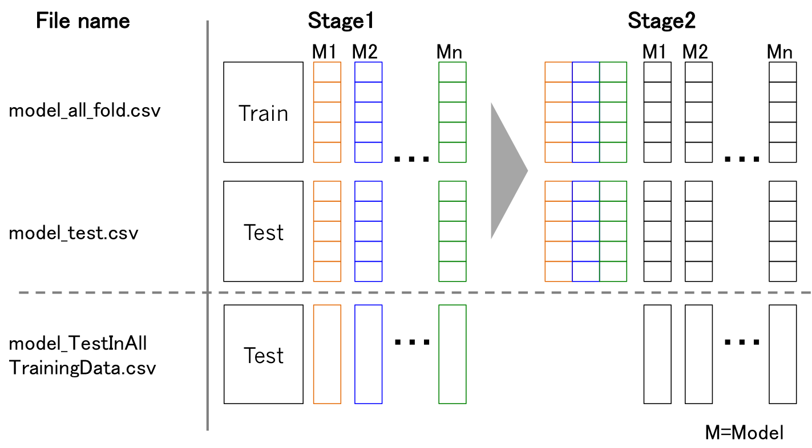

<!--
 * @Descripttion: 
 * @Version: 1.0
 * @Author: ZhangHongYu
 * @Date: 2021-09-19 19:53:57
 * @LastEditors: ZhangHongYu
 * @LastEditTime: 2022-05-16 18:43:31
-->

# 基于数据挖掘的上市公司高送转预测

[](https://github.com/orion-orion/TipDMCup20)
[](https://github.com/orion-orion/TipDMCup20/blob/master/LICENSE)
[](https://github.com/orion-orion/TipDMCup20)
[](https://github.com/orion-orion/TipDMCup20/issues)


### 赛题要求

本项目为泰迪杯2020A题《基于数据挖掘的上市公司高送转预测》，赛题要求针对给出的因子数据,根据经济学意义以及数理统计方法,筛选出对上公司实施高送转方案有较大影响的因子；并利用确定的因子,建立模型来预测哪些上市公司可能会实施高送转, 然后对附件提供的数据,用所建立的模型来预测第８年上市公司实施高送转的情况。

### 模型架构

采用stacking集成学习结构，基分类器包括LR, KNN, DecisionTree, ExtraTree, RF, XGBoost。第二层次级分类器采用XGBoost。因为是正负样本不均衡问题，我们采用SMOTE过采样技术对正负样本进行平衡，并采用AUC-Score做为模型评价标准。具体Stacking架构如项目目录下所示：



### 环境依赖
运行以下命令安装环境依赖：

```shell
pip install -r requirements.txt
```

### 数据集

数据集直接采用的赛方给定的企业高送转数据集，放在项目目录中的data文件夹下。下载链接可参见：

[Google drive 下载链接](https://drive.google.com/drive/folders/1ULeSHtIW-rVpqiQyEB_OONA3vUdxDAYU?usp=sharing)


### 项目目录说明

-data  -------------------  存放数据

-features_imp  -------------------  存放选出top_n特征以及其重要性

-features_model  -------------------  存放用于特征选择的相关模型

-model  -------------------  存放最终训练的相关模型

-pic  -------------------  存放Stacking架构图

-prediction  -------------------  存放对第８年数据的预测结果

-feature_eng.py  -------------------  特征工程的实现，包括数据预处理、特征选择、降维等

-main.py  -------------------  主文件，用于从构建特征工程到模型的训练与评估的pipline

-stacking.py  -------------------  stacking集成学习的模型代码

### 使用方法

运行:

```
python main.py \
    --features_model load \
    --main_model retrain 
```

`features_model`参数表示选择是否重新开始训练特征选择模型，若需重新训练特征选择模型可将 `feature_model `参数设置为 `retrain `，否则设置为 `load`直接加载已经选取好的特征。

`main_model`参数表示是否重新开始训练主模型（即集成学习模型），若需重新训练主模型可将 `main_model `参数设置为 `retrain `，否则设置为 `load`直接加载已经训练并保存好的模型（但前提是模型已经放置于 `model`目录下）。
